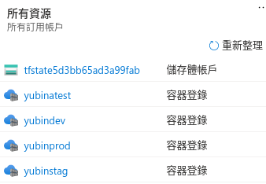

# module 的概念
- 先準備 child module(../../modules/container_registry)
- 在 registry.tf 先設定 local 變數，在 module 引入並用 for_each 來產生多(3)個 instance，並設定其參數
- 因為是使用 foudation 的 storage account，所以要先 init foundation
```shell
# 拿相關資訊
terraform output
cd ../container_registry_module/
terraform init
```
- init 之後，會有 .terraform/modules/modules.json , 包含module 資訊
```shell
cat .terraform/modules/modules.json | jq '.Modules'
```
- 第一個是 root module，二三是用 container_registry module 所產生的兩個module
```json
[
  {
    "Key": "",
    "Source": "",
    "Dir": "."
  },
  {
    "Key": "registry",
    "Source": "../../modules/container_registry",
    "Dir": "../../modules/container_registry"
  },
  {
    "Key": "test",
    "Source": "../../modules/container_registry",
    "Dir": "../../modules/container_registry"
  }
]
```
- terraform plan 之後，顯示將會建立4 object，一個test 三個 registry object

