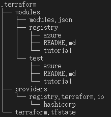
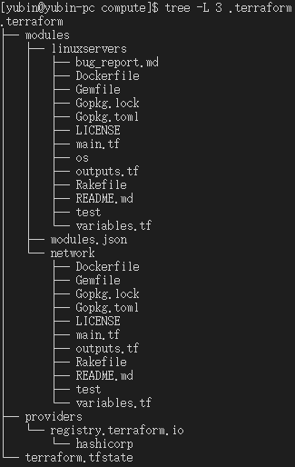

從遠端載入模組
[Ref](https://ithelp.ithome.com.tw/articles/10260669)
- 除了從 local 資料夾導入 module 外，比較實用的方式是從 remote 導入，而最常用的就是 Git
- 只要把 source 的地方改成從 Git 導入的寫法就可以[git_remote](https://www.terraform.io/language/modules/sources#generic-git-repository)
- terraform init 後，會先下載所指定 module 再檢查 backend
```shell
# 發現在不同 module 都會 git clone 各一次
tree -L 3 .terraform
```


# 練習
參考 [git_script](https://github.com/chechiachang/terraform-30-days/tree/main/azure/_poc/compute)
- 先將 provider.tf 直接 soft link 到 local
```shell
ln -fs ../container_registry_module/provider.tf ./provider.tf
```
- 再依照參考的 compute.tf 複製過來
  - 需要確認 locals 的 resource_group_name，要跟 foundation 設定相同
  - 會開一個 linuxservers，可以確認參數 [link](https://registry.terraform.io/modules/Azure/compute/azurerm/latest)
    - vm_os_simple 可以選的要用指令去查
    ```shell
    # 只列出 offer，可以挑的也沒多少
    az vm image list -f UbuntuServer --all
    az vm image list --location southeastasia | jq '.[] | .offer'
    # 查一下可以用的 size
    az vm list-skus --location southeastasia --resource-type virtualMachines --size Standard_B --all --output table
    ```
    - 另外也需要開一個 network 去開子網路 [link](https://registry.terraform.io/modules/Azure/network/azurerm/latest)
- 因為需要把 tfstate 存在 storage 裡面，所以要先從 foudation 做 init，拿到 storage_account_name 再來設定
- init 好之後，看起來是用 ruby 做 test

- 在 使用的 vm ubuntu 18 預設需要拿 ~/.ssh/id_rsa.pub 當  ssh key，可以另外 assign 位置
```shell
ssh_key = "~/.ssh/id_ed25519.pub"
```
# error
- 目前遇到 resource not available
```shell
Error: compute.VirtualMachinesClient#CreateOrUpdate: Failure sending request: StatusCode=0 -- Original Error: autorest/azure: Service returned an error. Status=<nil> Code="SkuNotAvailable" Message="The requested size for resource '/subscriptions/6139929e-3618-491b-8366-698d265b08d3/resourceGroups/ex-terraform-poc/providers/Microsoft.Compute/virtualMachines/yubin-for-test-vmLinux-0' is currently not available in location 'southeastasia' zones '' for subscription '6139929e-3618-491b-8366-698d265b08d3'. Please try another size or deploy to a different location or zones. See https://aka.ms/azureskunotavailable for details."
```
原來是這個 location 不支援 "Standard_B1s"
... 試到最後改了些設定發現，沒付錢有太多限制，先跳過這裡
