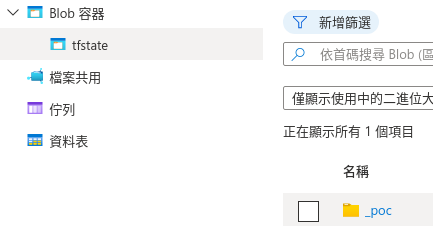

[Ref](https://ithelp.ithome.com.tw/articles/10259896)
tfState 經過 backend 存佈署相關資料，並有 lock 機制防止多人協作會發生的 apply 問題，但如果是使用 local backend 則造成僅有單人保持狀態，而 terraform 提供許多 remote backend 來使多人協作便利
# coding
[github](https://github.com/chechiachang/terraform-30-days/tree/main/azure/_poc/container_registry)
- 需要先準備好 storage container ，可以先用 fundation 去apply 來建立 storage account
- 解析 storage account 的相關資訊填入 registry.tf
```shell
cat ../foundation/terraform.tfstate | jq '.outputs'
# 或是直接用 terraform 指令
terraform output
```
```json
{
  "resource_group_name": {
    "value": "ex-terraform-poc",
    "type": "string"
  },
  "storage_account_name": {
    "value": "tfstate2a6e9e4a6b0a537b",
    "type": "string"
  },
  "storage_container_name": {
    "value": "tfstate",
    "type": "string"
  }
}
```
- 進行 terraform init 下載相關 data，並進行apply，就可以在 azure 的 storage account 看到 tfstate，而且不會在 local 


## 測試多人協作狀況
```shell
mkdir container_registry_clone
cd container_registry_clone
ln -s ../container_registry/provider.tf provider.tf
ln -s ../container_registry/registry.tf registry.tf
ln -s ../container_registry/variables.tf variables.tf
```
- 進行terraform apply 之後，會發現因為 nochange 而都以 cache 進行確認，並不會產生新的tfState，而且在同一個 backend 就會有 lock 的機制，讓多人協作時，不會造成重複行的apply
